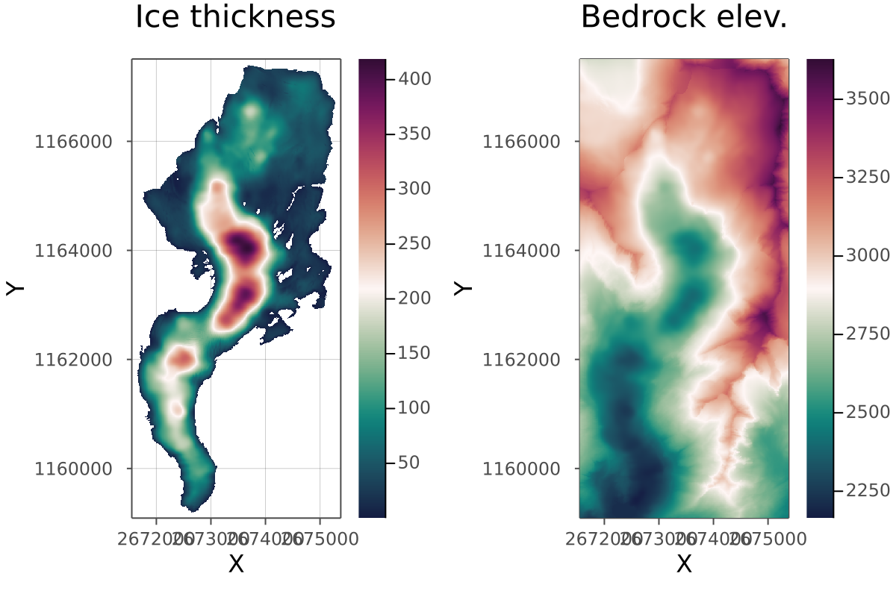

# 🌎 GeoData
Helper functions to select Alpine glacier geometry based on [SGI catalogue data ID](https://www.research-collection.ethz.ch/handle/20.500.11850/434697) ([click here for direct download](https://www.research-collection.ethz.ch/bitstream/handle/20.500.11850/434697/00_TablesIllustrations%28updatedversion%29.pdf?sequence=39&isAllowed=y)) and to preprocess related elevation data.



Contains also helper functions to extract [BedMachine Greenland and Antarctica data](https://sites.uci.edu/morlighem/dataproducts/) in order to process related elevation data.

## Workflow
### Geometry selection
First run the [geometry_selection.jl](geometry_selection.jl) script to extract, for a given glacier outline, the following data which will be saved as GeoTif (`.tif`):
- Ice thickness
- Surface elevation
- Bedrock elevation

The `geom_select` function expects the following data to be available in a `data/alps_sgi` folder:
- IceThickness.tif
- SwissALTI3D_r2019.tif
- swissTLM3D_TLM_BODENBEDECKUNG_ost.dbf
- swissTLM3D_TLM_BODENBEDECKUNG_ost.shp
- swissTLM3D_TLM_BODENBEDECKUNG_west.dbf
- swissTLM3D_TLM_BODENBEDECKUNG_west.shp
- swissTLM3D_TLM_GLAMOS.dbf

The `alps_sgi` folder size is about 6 GB and can be [downloaded here (Dropbox)](https://www.dropbox.com/s/3htehzra9bv6j75/alps_sgi.zip?dl=0). Upon download, unzip and place it in the `data` folder. _See [Sources](#sources) for references._

The `geom_select` function takes as argument the glacier `SGI_ID` and the corresponding name `name`. As keyword args, one can modify `padding`, and switch-off viualisation `do_vis=false` or saving `do_save=false`. Type `? geom_select` in the REPL for more details.

### BedMachine data
The `extract_bm_data` function ([data_extraction3D.jl](data_extraction3D.jl) script) expects the BedMachine NetCDF data files to be present in `/data/bedmachine_src` folder. The `bedmachine_src` folder can be [downloaded here (Dropbox)](https://www.dropbox.com/s/qn836lzxexapfvx/bedmachine_src.zip?dl=0). Upon download, unzip and place it in the `data` folder. See https://sites.uci.edu/morlighem/dataproducts/ for related details and direct downloads from the official repository.

### Data extraction
The [data_extraction3D.jl](data_extraction3D.jl) script contains two functions to extract geadata from:
1. Alpine glacier ([previous step](#geometry-selection)), see `extract_geodata` function;
2. Reading in NetCDF files from BedMachine ([previous step](#bedmachine-data)), see `extract_bm_data` function. 

These functions return bedrock and surface elevation maps, spatial coordinates and bounding-box rotation matrix, taking as input the ice thickness and bedrock elevation data. Type `? extract_geodata` or `? extract_bm_data` in the REPL for more details.

This step outputs an HDF5 file containing, e.g., the following fields to be further used as input for numerical simulation:
```julia-repl
🗂️ HDF5.File: ../data/alps/data_Rhone.h5
└─ 📂 glacier
   ├─ 🔢 R
   ├─ 🔢 x
   ├─ 🔢 y
   ├─ 🔢 z_bed
   └─ 🔢 z_surf
```

## Sources
The sources of the files contained in the Dropbox folder available for download are:
- [Swisstopo swissTLM3D](https://www.swisstopo.admin.ch/en/geodata/landscape/tlm3d.html#download)
  - swissTLM3D_TLM_*.dbf | [swisstlm3d_2022-03_2056_5728.shp.zip](https://data.geo.admin.ch/ch.swisstopo.swisstlm3d/swisstlm3d_2022-03/swisstlm3d_2022-03_2056_5728.shp.zip) (located in `TLM_BB/` upon unzip)

- [Swiss Glacier Thickness – Release 2020 (ETH Research Collection)](https://www.research-collection.ethz.ch/handle/20.500.11850/434697)
  - IceThickness.tif | [04_IceThickness_SwissAlps.zip (ZIP, 1.605Gb)](https://www.research-collection.ethz.ch/bitstream/handle/20.500.11850/434697/04_IceThickness_SwissAlps.zip?sequence=10&isAllowed=y)
  - SwissALTI3D_r2019.tif | [08_SurfaceElevation_SwissAlps.zip (ZIP, 1.837Gb)](https://www.research-collection.ethz.ch/bitstream/handle/20.500.11850/434697/08_SurfaceElevation_SwissAlps.zip?sequence=41&isAllowed=y)

- [BedMachine](https://sites.uci.edu/morlighem/dataproducts/)

## Extra
The Dropbox `alps_sgi` and `bedmachine_src` zip files can be fetched, respectively, via `wget` as following:
```
wget https://www.dropbox.com/s/3htehzra9bv6j75/alps_sgi.zip
wget https://www.dropbox.com/s/qn836lzxexapfvx/bedmachine_src.zip
```
