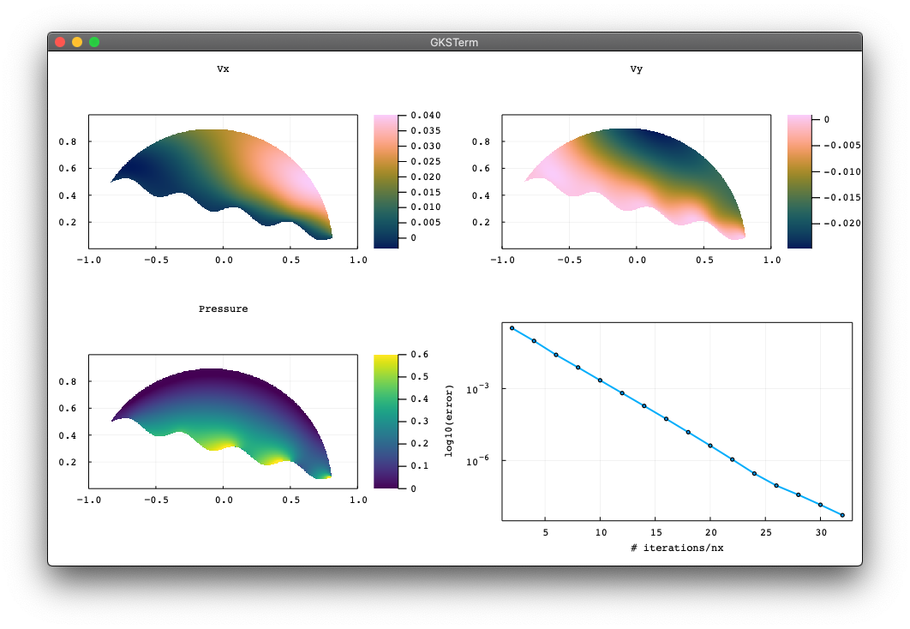

# FastIce.jl
Parallel (multi-)XPU iterative fast iceflow solvers

## Steady glacier 2D
Mechanical viscous steady-state flow with stress-free surface over bumpy bed in 2D. Figure is produced running the ([`SteadyStateGlacier2D.jl`](scripts/SteadyStateGlacier2D.jl)) code.

## Refs
Reference [list](/docs/references.md) (to be updated)
