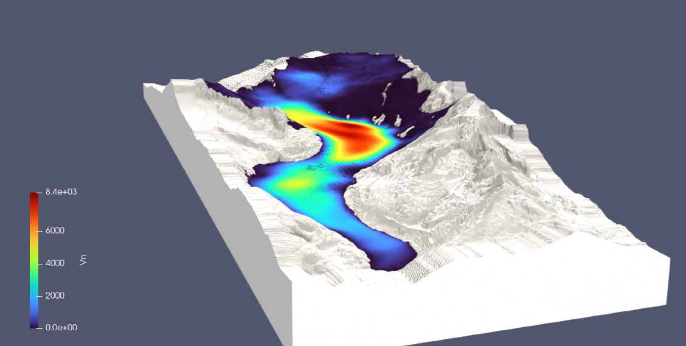
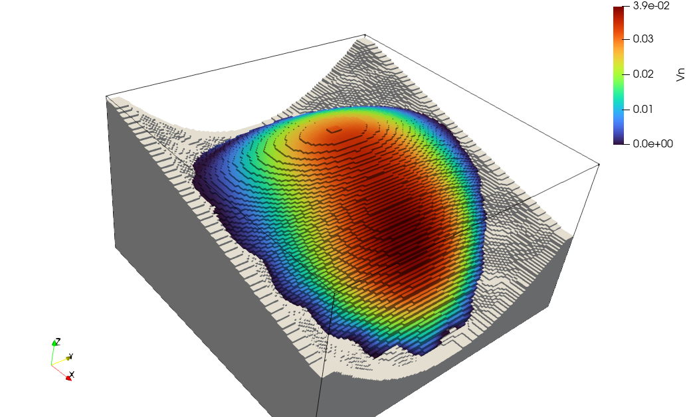
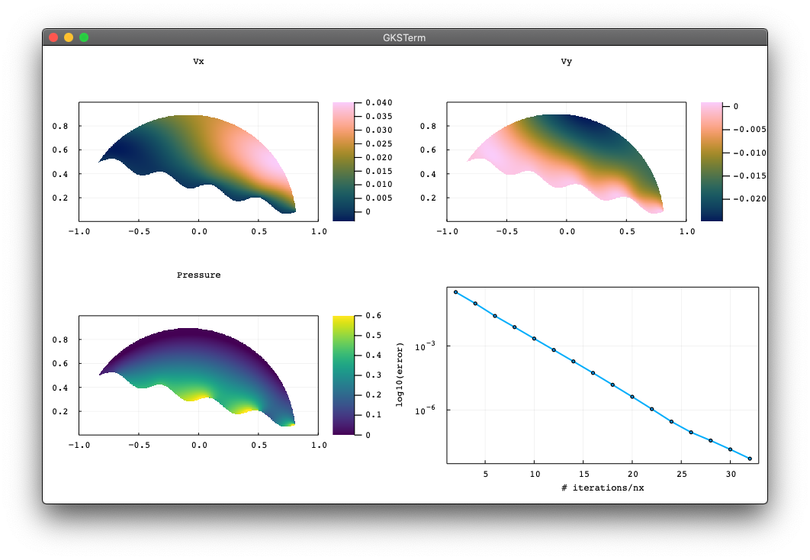

# FastIce.jl
Parallel (multi-)XPU iterative fast iceflow solvers

## Steady glacier 3D multi-XPU

> [`SteadyStateGlacier3D_xpu.jl`](scripts3D/SteadyStateGlacier3D_xpu.jl) code

Mechanical viscous steady-state flow with stress-free surface over Alpine topogrpahy in 3D

Multi-XPU iceflow solver and [GeoData helpers](GeoData). Here resolving steady viscous ice flow for the Rhone glacier in th Swiss Alps on 1022x1022x766 grid points on 8 Nvidia Tesla A100 server _Superzack_, hosted at VAW, ETH Zurich.

##

> [`SteadyStateGlacier3D_TM_xpu.jl`](scripts3D/SteadyStateGlacier3D_TM_xpu.jl) code

Thermo-Memhanical viscous flow with stress-free surface over synthetic topogrpahy in 3D

Multi-XPU thermo-mechanical iceflow solver.

## Steady glacier 2D

> [`SteadyStateGlacier2D.jl`](scripts/SteadyStateGlacier2D.jl) code

Mechanical viscous steady-state flow with stress-free surface over bumpy bed in 2D.

## Refs
Reference [list](/docs/references.md) (to be updated)
